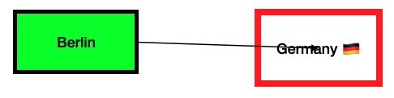

# Open Canvas Interchange Format (OCIF)

**OCWG Candidate Recommendation, March 2026**

**This version:** \
&nbsp;&nbsp;&nbsp;&nbsp;&nbsp;&nbsp; https://spec.canvasprotocol.org/v0.7.0 \
**Latest version:** \
&nbsp;&nbsp;&nbsp;&nbsp;&nbsp;&nbsp; https://spec.canvasprotocol.org/v0.7.0 \
**Previous version:** \
&nbsp;&nbsp;&nbsp;&nbsp;&nbsp;&nbsp; https://spec.canvasprotocol.org/v0.6

**Feedback:** \
&nbsp;&nbsp;&nbsp;&nbsp;&nbsp;&nbsp; https://github.com/orgs/ocwg/discussions

**Editor:** \
&nbsp;&nbsp;&nbsp;&nbsp;&nbsp;&nbsp;Dr. Max Völkel ([ITMV](https://maxvoelkel.de), [GraphInOut](https://graphinout.com))

**Authors (alphabetically):** \
&nbsp;&nbsp;&nbsp;&nbsp;&nbsp;&nbsp;[Aaron Franke](https://github.com/aaronfranke/) (Godot Engine), \
&nbsp;&nbsp;&nbsp;&nbsp;&nbsp;&nbsp;[Maikel van de Lisdonk](https://devhelpr.com) ([Code Flow Canvas](https://codeflowcanvas.io/)), \
&nbsp;&nbsp;&nbsp;&nbsp;&nbsp;&nbsp;[Jess Martin](https://jessmart.in) ([sociotechnica](https://sociotechnica.org)), \
&nbsp;&nbsp;&nbsp;&nbsp;&nbsp;&nbsp;Orion Reed

Copyright © 2024, 2025, 2026 the Contributors to the Open Canvas Working Group (OCWG).

## Abstract

An interchange file format for canvas-based applications. Visual nodes, their structural relations, assets, and schemas.

## Status of this Document

This document is a candidate recommendation (CR). The Open Canvas Working Group (OCWG) is inviting implementation feedback.

**Legal**:
Open Canvas Interchange Format (OCIF) v0.7.0 © 2025-2026 by Open Canvas Working Group is licensed under CC BY-SA 4.0. To view a copy of this licence, visit https://creativecommons.org/licenses/by-sa/4.0/

## Document Conventions

- Types:
  This document defines a catalog of _OCIF types_, which are more precise than the generic JSON types.
  See [OCIF Types](#ocif-types) for a catalog.
- The terms _OCIF file_ and _OCIF document_ are used interchangeably.

### Table of Contents

<!-- TOC -->

- [Open Canvas Interchange Format (OCIF)](#open-canvas-interchange-format-ocif)
  - [Abstract](#abstract)
  - [Status of this Document](#status-of-this-document)
  - [Document Conventions](#document-conventions)
    - [Table of Contents](#table-of-contents)
- [Introduction](#introduction)
  - [Hello World Example](#hello-world-example)
- [File Structure](#file-structure)
  - [Canvas Extensions](#canvas-extensions)
    - [Canvas Viewport](#canvas-viewport)
- [Entity](#entity)
- [Item](#item)
- [Nodes](#nodes)
  - [Structural Properties](#structural-properties)
  - [Layout Properties](#layout-properties)
  - [Content Properties](#content-properties)
  - [Extension Properties](#extension-properties)
  - ["Text Nodes"](#text-nodes)
  - ["Image Nodes"](#image-nodes)
  - [Root Node](#root-node)
    - [Nesting Canvases](#nesting-canvases)
      - [Partial Export](#partial-export)
- [Node Extensions](#node-extensions)
  - [Shape Extensions](#shape-extensions)
    - [Rectangle Extension](#rectangle-extension)
    - [Oval Extension](#oval-extension)
    - [Arrow Extension](#arrow-extension)
    - [Path Extension](#path-extension)
  - [Layout Extensions](#layout-extensions)
    - [Ports Extension](#ports-extension)
    - [Global Positions Extension](#global-positions-extension)
    - [Anchored Node Extension](#anchored-node-extension)
  - [Style Extensions](#style-extensions)
    - [Text Style Extension](#text-style-extension)
    - [Theme Definition Extension](#theme-definition-extension)
    - [Theme Selection Extension](#theme-selection-extension)
  - [Structural Extensions](#structural-extensions)
    - [Inheritance Extension](#inheritance-extension)
    - [Page Extension](#page-extension)
    - [Group Extension](#group-extension)
    - [Edge Extension](#edge-extension)
    - [Hyperedge Extension](#hyperedge-extension)
- [Assets](#assets)
  - [Resources](#resources)
    - [Representation](#representation)
    - [Fallback](#fallback)
    - [Nodes as Resources](#nodes-as-resources)
      - [Semantics](#semantics)
  - [Schemas](#schemas)
    - [Built-in Schema Mappings](#built-in-schema-mappings)
- [Extensions](#extensions)
  - [Extension Mechanism](#extension-mechanism)
  - [Defining Extensions](#defining-extensions)
    - [How To Write an Extension Step-by-Step](#how-to-write-an-extension-step-by-step)
  - [Data Extension](#data-extension)
  - [Exporting Data with Extensions](#exporting-data-with-extensions)
  - [Handling Extension Data](#handling-extension-data)
- [OCIF Types](#ocif-types)
  - [OCIF Structural Types](#ocif-structural-types)
  - [OCIF Primitive Types](#ocif-primitive-types)
    - [Angle](#angle)
    - [Color](#color)
    - [ID](#id)
    - [MIME Type](#mime-type)
    - [Schema Name](#schema-name)
    - [URI](#uri)
    - [Vector](#vector)
- [Practical Recommendations](#practical-recommendations)
- [References](#references)
- [Appendix](#appendix)
  - [Built-in Schema Entries](#built-in-schema-entries)
  - [Examples](#examples)
    - [Node Extension: Circle](#node-extension-circle)
    - [Advanced Examples](#advanced-examples)
  - [OCWG URL Structure (Planned)](#ocwg-url-structure-planned)
  - [Syntax Conventions](#syntax-conventions)
  - [Changes](#changes)
    - [From v0.6 to v0.7.0](#from-v06-to-v070)
    - [From v0.5 to v0.6](#from-v05-to-v06)
    - [From v0.4 to v0.5](#from-v04-to-v05)
    - [From v0.3 to v0.4](#from-v03-to-v04)
    - [From v0.2.1 to v0.3](#from-v021-to-v03)
    - [From v0.2.0 to v0.2.1](#from-v020-to-v021)
    - [From v0.1 to v0.2](#from-v01-to-v02)
  <!-- TOC -->

# Introduction

This document describes the Open Canvas Interchange Format (OCIF), which allows canvas-applications to exchange their data.

**Other Documents** \
For more information about the goals and requirements considered for this spec, see the [Goals](../../design/goals.md), [Requirements](../../design/requirements.md) and [Design Decisions](../../design/design-decisions.md) documents.
**For practical advice on how to use OCIF, see the [OCIF Cookbook](../../cookbook.md).**

**Canvas** \
A canvas in this context is a spatial view, on which visual items are placed.
Often, these items have been placed and sized manually.

There is no formal definition of _(infinite) canvas applications_.
The following references describe the concept:

- https://infinitecanvas.tools/
- https://lucid.co/techblog/2023/08/25/design-for-canvas-based-applications

The goal is to allow different canvas apps to display a canvas exported from other apps, even edit it,
and open again in the first app, without data loss.

In this spec, we define a canvas as consisting of two main parts:

- **[Nodes](#nodes)**: The core entity. Most are visually placed on the canvas.
- **[Resources](#resources)**: Defines the content, such as text, vector drawings, raster images, videos, or audio files.

- A large set of [extensions](#extensions) allows stating details about node shape, layout, style, and its relation to other nodes.
- A **[Schemas](#schemas)** section makes extension structure explicit via JSON schemas.

At its core, nodes are rectangular containers showing a resource. But OCIF allows them to have other shapes or no visual representation at all.
Nodes can be placed using built-in concepts from game/layout engines or play a more structural role.

## Hello World Example

Given two nodes, a rectangle with the word "Berlin" and an oval with "Germany."
We let an arrow point from Berlin to Germany.
The arrow represents a relation of the kind "is capital of."



In OCIF, it looks like this (using JSON5 here):

```json5
{
  ocif: "https://canvasprotocol.org/ocif/v0.7.0",
  nodes: [
    {
      id: "berlin-node",
      position: [100, 100],
      size: [100, 50],
      resource: "berlin-res",
      /* a green rect with a 3 pixel wide black border line */
      data: [
        {
          type: "@ocif/rect",
          strokeWidth: 3,
          strokeColor: "#000000",
          fillColor: "#00FF00",
        },
      ],
    },
    {
      id: "germany-node",
      position: [300, 100],
      /* slightly bigger than Berlin */
      size: [100, 60],
      resource: "germany-res",
      /* a white rect with a 5 pixel wide red border line */
      data: [
        {
          type: "@ocif/oval",
          strokeWidth: 5,
          strokeColor: "#FF0000",
          fillColor: "#FFFFFF",
        },
      ],
    },
    {
      id: "arrow-1",
      data: [
        {
          type: "@ocif/arrow",
          strokeColor: "#000000",
          /* right side of Berlin */
          start: [200, 125],
          /* center of Germany */
          end: [350, 130],
          startMarker: "none",
          endMarker: "arrowhead",
        },
        {
          type: "@ocif/edge",
          start: "berlin-node",
          end: "germany-node",
          /* WikiData 'is capital of'.
           We could also omit this or just put the string 'is capital of' here. */
          rel: "https://www.wikidata.org/wiki/Property:P1376",
        },
      ],
    },
  ],
  resources: [
    { id: "berlin-res", representations: [{ mimeType: "text/plain", content: "Berlin" }] },
    { id: "germany-res", representations: [{ mimeType: "text/plain", content: "Germany 🇩🇪" }] },
  ],
}
```

More examples can be found in the [cookbook](./../../cookbook.md).

# File Structure

The OCIF file is a JSON object with the following properties:

| Property    | JSON Type | OCIF Type                         | Required     | Contents                          |
| ----------- | --------- | :-------------------------------- | ------------ | --------------------------------- |
| `ocif`      | `string`  | [URI](#uri)                       | **required** | The URI of the OCIF schema        |
| `rootNode`  | `string`  | [ID](#id)                         | optional     | A canvas root [node](#nodes)      |
| `data`      | `array`   | array of [Extension](#extensions) | optional     | Extended canvas data              |
| `nodes`     | `array`   | [Node](#nodes)[]                  | optional     | A list of [nodes](#nodes)         |
| `resources` | `array`   | [Resource](#resources)[]          | optional     | A list of [resources](#resources) |
| `schemas`   | `array`   | [Schema Entry](#schemas)[]        | optional     | Declared [schemas](#schemas)      |

- **OCIF**: The _Open Canvas Interchange Format_ schema URI.
  - The URI SHOULD contain the version number of the schema, either as a version number or as a date (preferred).
  - Known versions:
    - `https://spec.canvasprotocol.org/v0.1` Retrospectively assigned URI for the first draft at https://github.com/ocwg/spec/blob/initial-draft/README.md
    - `https://spec.canvasprotocol.org/v0.2` This is a preliminary version, as described in this draft, for experiments
    - `https://spec.canvasprotocol.org/v0.3` This is the first stable version.
    - `https://canvasprotocol.org/ocif/v0.7.0` Is the current version. Note the simplified URI format.

- **rootNode**: An optional [root node](#root-node) id. It MUST point to a node defined within the `nodes` array.

- **data**: Additional properties of the canvas.
  The canvas may have any number of extensions. Each extension is a JSON object with a `type` property.
  See [extensions](#extensions).

- **nodes**: A list of nodes on the canvas. See [Nodes](#nodes) for details.

- **resources**: A list of resources used by nodes. See [Resources](#resources) for details.

- **schemas**: A list of schema entries, which are used for extensions. See [Schemas](#schemas) for details.

JSON schema: [schema.json](schema.json)

**Example** \
A minimal valid OCIF file without any visible items or assets.

```json
{
  "ocif": "https://canvasprotocol.org/ocif/v0.7.0"
}
```

**Example** \
A small OCIF file, with one node and one resource.
Visually, this should render as a box placed with the top-left corner at (100,100), an application-determined size, containing the text `Hello, World!`.

```json
{
  "ocif": "https://canvasprotocol.org/ocif/v0.7.0",
  "nodes": [{ "id": "n1", "position": [100, 100], "resource": "r1" }],
  "resources": [{ "id": "r1", "representations": [{ "mimeType": "text/plain", "content": "Hello, World!" }] }]
}
```

## Canvas Extensions

The canvas itself, the whole OCIF document, is also an element that can be extended.
Like for nodes, canvas-level extensions are carried in an array named `data` on the root object of the OCIF file. Each entry in this array is an extension object with a `type` that identifies the extension and any extension-specific properties. Applications MAY add any number of canvas extensions; unknown extensions MUST be ignored.

Example:

```json
{
  "ocif": "https://canvasprotocol.org/ocif/v0.7.0",
  "data": [{ "type": "@ocif/canvas-viewport", "position": [0, 0], "size": [1000, 800] }],
  "nodes": [],
  "resources": []
}
```

### Canvas Viewport

The initial _viewport_ of an OCIF file can be defined with this viewport extension.

- Name: `@ocif/canvas-viewport`
- URI: `https://spec.canvasprotocol.org/v0.7.0/extensions/canvas-viewport.json`
- Usage: On the canvas (the OCIF document).

A viewport is a rectangle that defines at what part of a canvas the app should initially pan and zoom.
The viewport is defined relative to the canvas coordinate system, which is defined by its explicit or implicit [root node](#root-node).
A user's monitor and window sizing define an effective aspect-ratio.
The view should be centered within the available screen space.
The viewport should be shown as large as possible, while maintaining its defined aspect-ratio.
Thus, the effective rendered view might be showing more of the canvas on the top and bottom or on the left and right, than stated in the viewport.

NOTE: To achieve this, the application should calculate a zoom factor as `min(canvas_width / viewport_width, canvas_height / viewport_height)`. The view should then be centered by calculating the top-left pan offset as `x: (canvas_width - viewport_width * zoom) / 2` and `y: (canvas_height - viewport_height * zoom) / 2`.

| Property   | JSON Type | OCIF Type | Required     | Contents                                | Default     |
| ---------- | --------- | --------- | ------------ | --------------------------------------- | ----------- |
| `position` | `array`   | number[]  | **required** | Coordinate as (x,y) or (x,y,z).         | [0,0]       |
| `size`     | `array`   | number[]  | **required** | The size of the viewport per dimension. | `[100,100]` |

- **position**:
  The top-left corner of the viewport.

- **size**:
  The width and height (in 3D: also depth) of the viewport.

JSON schema: [canvas-viewport.json](extensions/canvas-viewport.json)

# Entity

OCIF uses abstract base types called _entity_ and _item_.
The _entity_ type allows for extension data and comments.
A direct sub-type of _entity_ is [representation](#representation).

| Property  | JSON Type | OCIF Type                         | Contents                              |
| --------- | --------- | --------------------------------- | ------------------------------------- |
| `data`    | `array`   | array of [Extension](#extensions) | Extended item data                    |
| `comment` | `string`  | string                            | A comment or description of the item. |

Comments exist to annotate OCIF files with additional information when reading the raw text of the file manually, like a comment in a programming language.
They MUST NOT be used for any functional purpose by software that processes OCIF files.
Comments MAY be preserved or discarded when processing OCIF files, and in either case the file is functionally equivalent.

- **[extension](#extension-properties)** (`data`, `comment`).

# Item

The _item_ type includes the _entity_ properties and adds a unique identifier (`id`).
Item sub-types are node, resource, and document types.
It defines these common properties:

| Property  | JSON Type | OCIF Type                         | Contents                              |
| --------- | --------- | --------------------------------- | ------------------------------------- |
| `id`      | `string`  | [ID](#id)                         | A unique identifier for the item.     |
| `data`    | `array`   | array of [Extension](#extensions) | Extended item data                    |
| `comment` | `string`  | string                            | A comment or description of the item. |

- **id**: A unique identifier for the item.
  Must be unique within an OCIF file.
  See [ID](#ocif-types) type for details.

# Nodes

Nodes are the main entities of a canvas.
They inherit properties from the [item](#item) type (`id`, `data`, `comment`)
A node is visible, also called visual node in this spec, if it has a position and size.
Conceptually, a visual node is a rectangle (bounding box) on the canvas, often displaying some content (resource).
A node without `position` and `size` can serve, for example, as a [logical grouping](#group-extension) or a purely structural [edge](#edge-extension). But most nodes on a canvas are usually visible.

A _Node_ is an `object` with the following properties:

- **[structural](#structural-properties)** (`id` (required),`parent`, `deleteWithParent`),
- **[layout](#layout-properties)** (`position`, `size`, `rotation`, `rotationAxis`, `scale`),
- **[content](#content-properties)** (`resource`, `resourceFit`), and
- **[extension](#extension-properties)** (`data`, `comment`).

## Structural Properties

These are structural properties of a node:

| Property           | JSON Type | OCIF Type | Required     | Contents                                 | Default |
| ------------------ | --------- | --------- | ------------ | ---------------------------------------- | ------- |
| `id`               | `string`  | [ID](#id) | **required** | A unique identifier for the node.        | n/a     |
| `parent`           | `string`  | [ID](#id) | optional     | ID of a [node](#nodes)                   | n/a     |
| `deleteWithParent` | `boolean` |           | optional     | Delete this node when parent is deleted. | `true`  |

- **id**: A unique identifier for the node. Must be unique within an OCIF file. See [ID](#ocif-types) type for details.

- **parent**:
  The ID of a node to be used as **parent node**.
  If A has a parent B, we also say that A is a child of B.
  This parent-child relation models a strict hierarchical relationship between nodes.
  It establishes a hierarchical relationship that is used in computing the effective, global layout of a node, as explained in [2D/3D Layout Properties](#layout-properties).
  - If empty, the [root node of the canvas](spec.md#root-node) is the parent node. This is relevant for [node positioning](#layout-properties)

- **deleteWithParent**:
  A boolean flag indicating if the child (this node) should be deleted when the parent is deleted.
  The default is `true`.

## Layout Properties

OCIF allows customizing the local coordinate system of a node relative to the parent coordinate system.
Every node creates its own local coordinate system, in which displayed resources and child-nodes are interpreted.
Child nodes are defined by setting a `parent` property on the child.
If no parent node is defined, the node is positioned relative to the global, canvas-wide coordinate system.
In this case, local and global coordinates are the same.
If a parent node is stated and changed, local coordinates need to be recalculated, taking the whole chain of nested coordinate systems into account.
This is a concept commonly found in game engines and infinitely zoomable canvases.
For some cases, the [Anchored Node Extension](#anchored-node-extension) can be a better fit.
Mathematically, these are known as local-to-global transformations.
Transforms are chainable.
For example, a node A may transform its coordinate system relative to the canvas.
Node B may transform relative to the coordinate system of its parent A.
Then node C transforms the coordinate system again, relative to its parent B.
The resulting position, scale, and rotation computation requires computing first A, then B, then C.

| Property       | JSON Type            | OCIF Type       | Required | Contents                            | Default     |
| -------------- | -------------------- | --------------- | -------- | ----------------------------------- | ----------- |
| `position`     | `array`              | number[]        | optional | Coordinate as (x,y) or (x,y,z).     | [0,0]       |
| `size`         | `array`              | number[]        | optional | The size of the node per dimension. | `[100,100]` |
| `rotation`     | `number`             | [Angle](#angle) | optional | +/- 360 degrees                     | `0`         |
| `rotationAxis` | `number[3]`          |                 | optional | Rotation axis                       | `[0,0,1]`   |
| `scale`        | `number`, `number[]` | Vector          | optional | Scale factor                        | `1`         |

- **position**: The position of the node on the canvas, in the local coordinate system.
  - If defined, required are **x** (at position `0`) and **y** (at position `1`). Optional is **z** at position `2`.
  - The _coordinate system_ has the x-axis pointing to the right, the y-axis pointing down, and the z-axis pointing away from the screen. This is the same as in CSS, SVG, and most 2D and 3D graphics libraries. The origin is the top-left corner of the canvas.
  - The unit is logical pixels (as used in CSS for `px`).
  - The positioned point (to which the `position` refers) is the top-left corner of the node.
  - The position is in the local coordinate system. It can be used to compute a global position. If you wish to store the global position directly, the [global positions](extensions/global-positions.json) extension can be used to cache the computed global position.
  - The default for z position is `0` when importing 2D as 3D.
  - When importing 3D as 2D, the z position is ignored (but can be left as-is). When a position is changed, the z position CAN be set to 0. Yes, this implies that full round-tripping is not always possible.
  - Values on all three dimensions can be negative.

- **size**: The size of the node per dimension.
  This is **x-axis** ("width" at position `0`), **y-axis** ("height" at position `1`), and **z-axis** ("depth" at position `2`). The size is expressed in the local coordinate system of the node.
  - Size might be omitted if a linked resource defines the size. More precisely: if _all_ [resource representations](#representation) define a size.
  - Raster images, such as PNG and JPEG, define their size in pixels.
  - Vector images, such as SVG, can have a `viewbox` defined, but may also omit it.
  - Text can be wrapped at any width, so a size property is required.
  - In general, a size property is useful as a fallback to display a placeholder rectangle if the resource cannot be displayed as intended.

- **scale**: A number-vector (floating-point) to override (set) the automatic scale factor of the node. This defines the scale of the local coordinate system. A larger scale SHOULD also affect font sizes. The scale factors are multiplied component-wise to the parent coordinate system.
  - NOTE: The scale factors cannot be computed from global positions alone.
    Scale factors provide additional state which influences interaction behaviour, e.g., an item drag-dropped into an item with a scale factor of less than 1 causes the item to shrink when released.
  - For text rendering, the scale factors SHOULD be taken into account.

- **rotation**: A number (floating-point) to override (set) the rotation of the node.
  - This (relative, local) rotation is added to the rotation of the parent.
  - A single number around the axis defined in `rotationAxis`, in degrees in counter-clockwise direction.

- **rotationAxis**: The axis of rotation. This is the [axis-angle notation](https://en.wikipedia.org/wiki/Axis%E2%80%93angle_representation).
  - The default is `(0,0,1)`. This is the z-axis, which results in 'normal' 2D rotation in the x-y-plane.

**Practical Advice**\
For interactive apps, the transforms allow to adapt on parent changes.
Furthermore, when zooming very large maps, position and size should be computed on the fly, as global positions would become unstable due to numeric precision.

**Calculating Global Positions**\
The 2D box (or in 3D: cube) defined by `position` and `size` is mapped to global coordinates.
The full transformation matrix is 'TRS' ordered: `M = T * R * S`.
So first scale (S, `scale`) is applied, then rotation (R, `rotation`,`rotationAxis`).
OCIF has no translation (T).

**Example:** A node with a scale factor:

```json
{
  "id": "node-with-image",
  "position": [100, 100],
  "size": [100, 200],
  "resource": "frog",
  "scale": 0.5
}
```

## Content Properties

The position of a node (`position`) is the top-left corner of a rectangle. The width and height are given in `size`.
Together, they define a rectangle.
This rectangle acts as a placement box and **clipping mask** on the contents of the node.
The clipping mask should be oval if the [Oval Extension](#oval-extension) is used.
Content is specified with these properties:

| Property      | JSON Type | OCIF Type       | Required | Contents                 | Default   |
| ------------- | --------- | --------------- | -------- | ------------------------ | --------- |
| `resource`    | `string`  | [ID](#id)       | optional | The resource to display  |           |
| `resourceFit` | `string`  | enum, see below | optional | Fitting resource in item | `contain` |

- **resource**: A reference to a resource, which can be an image, video, or audio file. See [resources](#resources).
  - Resource can be empty, in which case a node is acting as a transform for other nodes.
  - Resource content is cropped/limited by the node boundaries.
    This is commonly called _clip children_.
    Only in this respect the resource content is a kind of child.
    In CSS, this is called `overflow: hidden`.
  - Resources can define ornamental borders, e.g., a rectangle has a rectangular border, or an [oval](#oval-extension) defines an oval border.
    The border itself is z-ordered in front of the resource content.

- **resourceFit**: Given a node with dimensions 100 (height) x 200 (width) and a bitmap image (e.g., a .png) with a size of 1000 x 1000.
  How should this image be displayed? We re-use some options from CSS ([object-fit](https://developer.mozilla.org/en-US/docs/Web/CSS/object-fit) property):
  - `none`: All pixels are displayed in the available space unscaled. The example would be cropped down to the 100 x 200 area top-left. No auto-centering.
  - `containX`: Scaled by keeping the aspect ratio, so that the image width matches the item width. This results in the image being displayed at a scale of `0.2`, so that it is 200 px wide and 200 px high.
    NOTE: This is called `keep-width` in Godot.
    The image is centered vertically.
    Empty space may be visible above and below the image.
    Never crops the image.
  - `containY`: Scaled by keeping the aspect ratio, so that the image height matches the item height. This results in the image being displayed at a scale of `0.1`, so that it is 100 px high and 100 px wide. The image is now fully visible, but there are boxes of empty space left and right of the horizontally centered image.
    Never crops the image.
    NOTE: This is called `keep-height` in Godot.
  - `contain`: Scaled by keeping the aspect ratio of the image, so that the image fits into the item for both height and width.
    The image is auto-centered vertically and horizontally.
    Empty space left and right _or_ top and bottom might appear.
    Never crops the image.
    This is equivalent to applying the smaller of the scale factors calculated for `containX` and `containY`.
    This is called 'keep aspect centered' in Godot.
  - `cover`: Scaled by keeping the aspect ratio of the image, so that the image fits into the item for one of height and width while the other dimension overlaps. The overlap is cropped away and not visible. The entire view area is filled.
  - `fill`: Aspect ratio is ignored and the image is simply stretched to match the width and height of the view box.
  - `tile`: If the image is larger than the viewport, it just gets cropped. If it is smaller, it gets repeated in both dimensions. CSS calls this `background-repeat: repeat`.

## Extension Properties

- **data**: Additional properties of the node.
  A node may have any number of extensions. Each extension is a JSON object with a `type` property.
  See [extensions](#extensions).

- **comment**: A comment in the OCIF file, not in the node.

| Property  | JSON Type | OCIF Type                         | Required | Contents                  | Default |
| --------- | --------- | --------------------------------- | -------- | ------------------------- | ------- |
| `comment` | `string`  | string                            | optional | A comment about the node. |         |
| `data`    | `array`   | array of [Extension](#extensions) | optional | Extended node data        |         |

## "Text Nodes"

There is no special text node in OCIF. Text is a kind of resource. A node can display a resource.
See [Resources](#resources) for details on text resources.

**Example:** A node showing "Hello, World!" as text.

```json
{
  "nodes": [
    {
      "id": "n1",
      "position": [300, 200],
      "resource": "r1"
    }
  ],
  "resources": [
    {
      "id": "r1",
      "representations": [
        {
          "mimeType": "text/plain",
          "content": "Hello, World!"
        }
      ]
    }
  ]
}
```

TIP: Additional node extensions (e.g. [Rectangle](#rectangle-extension)) can be used to "style" the text node, e.g., by adding a background color or a border.

## "Image Nodes"

There is no special image node in OCIF. An image is another kind of resource, which can be displayed by any node.

**Example:** A node showing an image.

```json
{
  "nodes": [
    {
      "id": "n1",
      "position": [300, 200],
      "resource": "r1"
    }
  ],
  "resources": [
    {
      "id": "r1",
      "representations": [
        {
          "mimeType": "image/png",
          "location": "https://example.com/image.png"
        }
      ]
    }
  ]
}
```

TIP: Additional node extensions can be used. E.g., an [Oval](#oval-extension) could be used to display the image cropped as a circle.

## Root Node

Every canvas has **one** defined or implied _root node_.
The root node itself SHOULD not be rendered, only its interior.
If no root node is defined, an implied root with ID `rootNode` is used.
Or seen from the other direction: The root node 'contains' all nodes that are not explicitly contained by another node.
The root node cannot be used as a child of another node within the same file, but instances may be child nodes in another file.
If a non-root node is not a child of another node, it is implicitly a child of the root node.

All text styles are already defined as default values of optional properties in the [text style](spec.md#text-style-extension) extension.
A root node can define these values to set custom standard values for a whole canvas.

The `size` property of the root node effectively defines a canvas size, much like the [viewbox](https://www.w3.org/TR/SVGTiny12/coords.html#ViewBoxAttribute) of an SVG file.
However, while a `viewbox` in SVG allows setting the root position, the coordinate system of an OCIF file always starts in the top-left corner at (0,0).

The root node represents the entire OCIF file, and it does not make sense for a node to have a transform relative to itself. Therefore, the `position` and `rotation` properties of the root node MUST NOT be set. If the root node has either of those properties set, the app should ignore their values and emit a warning.

### Nesting Canvases

A [node](#nodes) 'A' in a canvas (now called 'host canvas') may use a [resource](#resources) of type `application/ocif+json` (the [recommended IANA MIME type](#practical-recommendations) for OCIF files).
That resource defines another canvas (now called 'sub-canvas').
Per definition, the sub-canvas has an explicit or implicit [root node](#root-node).
From the perspective of the host canvas, node 'A' and the sub-canvas root node 'B' **are the same node**.

The properties of the **host** canvas node 'A' extend and overwrite the properties of the imported **child** canvas root node. This even overwrites the `id` property, so that the former 'B' is now 'A' in the host canvas.
NOTE: All OCIF definitions referring to node 'B' are now also interpreted as referring to 'A'.
This allows re-using existing canvases in different ways.
That is, the host node 'A' is interpreted as a JSON Merge Patch ([RFC 7396](https://www.rfc-editor.org/info/rfc7396)) document against the sub-canvas root node 'B'.

There is one exception: `data`-extension arrays are always _merged_ (see [extension mechanism](#extension-mechanism)):
Both arrays are appended, first the sub-canvas root nodes extensions, then the host nodes 'A' extensions.
Later entries overwrite earlier entries for the same `type` of extension.

#### Partial Export

NOTE: When exporting a node from a canvas (and all its child nodes per parent-child relation), that node should become the root node of the exported sub-canvas. For consistency, all effective values, which may be inherited, need to be copied onto the exported root node. However, `position`, `rotation`, `rotationAxis`, and `parent` MUST be removed from the new root node, as the root defines the origin (0,0) of the new canvas.

# Node Extensions

These are [extensions](spec.md#extensions) that can be added to nodes in an OCIF document.
To be placed inside the `data` `array`.
The current list of node extensions is explained next.
The influence a nodes [shape](#shape-extensions), [layout](#layout-extensions), [style](#style-extensions), and [structural](#structural-extensions) features such as [inheritance](#inheritance-extension) and [grouping](#group-extension).

In addition to the types defined here, anybody can define and use their own extension types.
If this is your first read of the spec, skip over the details of the extension types and come back to them later.

## Shape Extensions

Each node should have zero or one shape. Using more than one shape extension has no clear interpretation.

### Rectangle Extension

- Name: `@ocif/rect`
- URI: `https://spec.canvasprotocol.org/v0.7.0/extensions/rect.json`
- Usage: On a [node](#nodes).

A rectangle is a visual node [extension](#extensions), to define the visual appearance of a node as a rectangle.
A core node has already a position, size, rotation, scale.

| Property      | JSON Type | OCIF Type       | Required | Contents                 | Default   |
| ------------- | --------- | --------------- | -------- | ------------------------ | --------- |
| `strokeWidth` | `number`  | number          | optional | The line width.          | `1`       |
| `strokeColor` | `string`  | [Color](#color) | optional | The color of the stroke. | `#FFFFFF` |
| `fillColor`   | `string`  | [Color](#color) | optional | The color of the fill.   | (none)    |

- **strokeWidth**:
  The line width in logical pixels. Default is `1`. Inspired from SVG `stroke-width`.
- **strokeColor**:
  The color of the stroke. Default is white (`#FFFFFF`). Inspired from SVG `stroke`.
- **fillColor**:
  The color of the fill. Default is `none`, resulting in the node being fully transparent and allowing clicks to pass through.

z-order: The stroke (`strokeWidth`, `strokeColor`) SHOULD be rendered "on top" of a resource, while the fill (`fillColor`) SHOULD be rendered "behind" the resource.
So a _fillColor_ can be used for a background color.

These properties are meant to customize the built-in default stroke of a canvas app.
For example, if all shapes in a canvas app are red and a node is using the rectangle extension but defines no color, the node should be red as well.

JSON schema: [rect.json](extensions/rect.json)

### Oval Extension

- Name: `@ocif/oval`
- URI: `https://spec.canvasprotocol.org/v0.7.0/extensions/oval.json`
- Usage: On a [node](#nodes).

An oval is a visual node extension, to define the visual appearance of a node as an oval.
An oval in a square bounding box is a circle.

An oval has the exact same properties as a [Rectangle](#rectangle-extension), just the rendering is different.
The oval shall be rendered as an ellipse, within the bounding box defined by the node's position and size.

JSON schema: [oval.json](extensions/oval.json)

### Arrow Extension

- Name: `@ocif/arrow`
- URI: `https://spec.canvasprotocol.org/v0.7.0/extensions/arrow.json`
- Usage: On a [node](#nodes).

An arrow is a visual node that connects two point coordinates.
It should be rendered as a straight line, with optional direction markers at the start and end.

| Property      | JSON Type | OCIF Type       | Required     | Contents                | Default   |
| ------------- | --------- | --------------- | ------------ | ----------------------- | --------- |
| `strokeWidth` | `number`  | number          | optional     | The line width.         | `1`       |
| `strokeColor` | `string`  | [Color](#color) | optional     | The color of the arrow. | `#FFFFFF` |
| `start`       | `array`   | number[]        | **required** | The start point.        | n/a       |
| `end`         | `array`   | number[]        | **required** | The end point.          | n/a       |
| `startMarker` | `string`  | string          | optional     | Marker at the start.    | `none`    |
| `endMarker`   | `string`  | string          | optional     | Marker at the end.      | `none`    |

- **strokeWidth**:
  The line width in logical pixels. Default is `1`. Inspired from SVG `stroke-width`.

- **strokeColor**:
  The color of the arrow. Default is white (`#FFFFFF`). Inspired from SVG `stroke`.

- **start**:
  The start point of the arrow. The array contains the x and y coordinates. \
  The z-coordinate, if present, is used only in 3D canvas apps.

- **end**:
  The end point of the arrow. The array contains the x and y coordinates. \
  The z-coordinate, if present, is used only in 3D canvas apps.

- **startMarker**:
  The marker at the start of the arrow.
  Possible values are:
  - `none`: No special marker at the start. A flat line at the start.
  - `arrowhead`: An arrow head at the start. The arrow head points at the start point.

- **endMarker**:
  The marker at the end of the arrow.
  Possible values are:
  - `none`: No special marker at the end. A flat line end at the end.
  - `arrowhead`: An arrow head at the end. The arrow head points at the end point.

NOTE on **position** and **size**:
An arrow should only include a position if a [resource](#resources) is stated to represent this arrow.
The geometric properties (start and end) often suffice.

The markers allow representing four kinds of arrow:

| startMarker | endMarker | Visual              |
| ----------- | --------- | ------------------- |
| none        | none      | start `-------` end |
| none        | arrowhead | start `------>` end |
| arrowhead   | none      | start `<------` end |
| arrowhead   | arrowhead | start `<----->` end |

NOTE: Canvas apps can use any visual shape for the markers, as long as the direction is clear.

JSON schema: [arrow.json](extensions/arrow.json)

### Path Extension

- Name: `@ocif/path`
- URI: `https://spec.canvasprotocol.org/v0.7.0/extensions/path.json`
- Usage: On a [node](#nodes).

A path is a visual node extension, to define the visual appearance of a node as a path.
The rendering of resources inside a path is not defined by OCIF, but by the canvas app.

| Property      | JSON Type | OCIF Type       | Required     | Contents               | Default   |
| ------------- | --------- | --------------- | ------------ | ---------------------- | --------- |
| `strokeWidth` | `number`  | number          | optional     | The line width.        | `1`       |
| `strokeColor` | `string`  | [Color](#color) | optional     | The color of the path. | `#FFFFFF` |
| `fillColor`   | `string`  | [Color](#color) | optional     | The color of the fill. | `none`    |
| `path`        | `string`  | string          | **required** | The path data.         | n/a       |

- **strokeWidth**:
  The line width in logical pixels. Default is `1`. Inspired from SVG `stroke-width`.

- **strokeColor**:
  The color of the path. Default is white (`#FFFFFF`). Inspired from SVG `stroke`.

- **fillColor**:
  The color of the fill. Default is none / fully transparent. Applies only to closed or self-intersecting paths.

- **path**:
  The path data, like the SVG path data `d` attribute. The path data is a string, which can contain the following commands:
  - `M x y`: Move to position x, y
  - `L x y`: Line to position x, y
  - `C x1 y1 x2 y2 x y`: Cubic Bézier curve to x, y with control points x1, y1 and x2, y2
  - `Q x1 y1 x y`: Quadratic Bézier curve to x, y with control point x1, y1
  - `A rx ry x-axis-rotation large-arc-flag sweep-flag x y`: Arc to x, y with radii rx, ry, x-axis-rotation, large-arc-flag, sweep-flag
  - `Z`: Close the path
  - The starting point of the path is the top-left corner of the node, i.e., the positioned point.
  - Coordinates are expressed in the nodes local coordinate system.

NOTE: Canvas apps can simplify rendering of curves (cubic/quadratic bezier, arc) to straight lines.

This extension is purposefully very similar to SVG. Attaching an SVG [resource](#resources) to a node has a similar visual effect.
Some differences are: resources can be re-used in other nodes, SVGs add a bit more overhead to an app compared to this path extension.
SVG resources allow more precise positioning using the `resourceFit` property, and have an additional SVG `viewbox`.
Overall, SVG has many more features compared to the path extension.
The path extension might be superior for apps that allow inline editing of paths, like in a scribble.

JSON schema: [path.json](extensions/path.json)

## Layout Extensions

The following extensions deal more with placement (layout) of nodes.

### Ports Extension

- Name: `@ocif/ports`
- URI: `https://spec.canvasprotocol.org/v0.7.0/extensions/ports.json`
- Usage: On a [node](#nodes).

It provides the familiar concept of _ports_ to a node. A port is a point that allows geometrically controlling where, e.g., arrows are attached to a shape.

Any node can act as a port. The 'container' node uses the _Ports Extension_ to define which nodes it uses as ports.
The _Ports Extension_ has the following properties:

| Property | JSON Type | OCIF Type        | Required     | Contents                      | Default |
| -------- | --------- | ---------------- | ------------ | ----------------------------- | ------- |
| `ports`  | `array`   | [ID](spec.md#id) | **required** | IDs of nodes acting as ports. |         |

Each node SHOULD appear only in **one** ports array.
A port cannot be used by multiple nodes as a port.

**Example** \
A node (_n1_) with two ports (_p1_, _p2_).
Note that _p1_ and _p2_ are normal nodes.
It is the node _n1_ that uses _p1_ and _p2_ as its ports.
An arrow can now start at node p1 (which is a port of n1) and end at node n2 (which is not a port in this example).

```json
{
  "nodes": [
    {
      "id": "n1",
      "position": [100, 100],
      "size": [100, 100],
      "data": [
        {
          "type": "@ocif/ports",
          "ports": ["p1", "p2"]
        }
      ]
    },
    {
      "id": "p1",
      "position": [200, 200]
    },
    {
      "id": "p2",
      "position": [100, 200]
    },
    {
      "id": "n2",
      "position": [800, 800]
    }
  ]
}
```

JSON schema: [ports.json](extensions/ports.json)

### Global Positions Extension

- Name: `@ocif/global-positions`
- URI: `https://spec.canvasprotocol.org/v0.7.0/extensions/global-positions.json`
- Usage: On a [node](#nodes).

To make it easy for simple viewers to show OCIF content, an OCIF file may pre-compute global positions and store them in this extension.
They are redundant, as the core OCIF node properties (position, size, rotation, rotationAxis, scale) fully define the global position.
The node can have these properties:

| Property         | JSON Type | OCIF Type       | Required    | Contents                                     | Default     |
| ---------------- | --------- | --------------- | ----------- | -------------------------------------------- | ----------- |
| `globalPosition` | `array`   | number[]        | recommended | Coordinate as (x,y) or (x,y,z).              | [0,0]       |
| `globalSize`     | `array`   | number[]        | recommended | The absolute size of the node per dimension. | `[100,100]` |
| `globalRotation` | `number`  | [Angle](#angle) | optional    | +/- 360 degrees                              | `0`         |

- **globalPosition**: The global, absolute position of the node on the canvas.
  - The global position can be computed from local, relative OCIF node properties such as `position`.
  - If defined, required are **x** (at position `0`) and **y** (at position `1`). Optional is **z** at position `2`.
  - The _coordinate system_ has the x-axis pointing to the right, the y-axis pointing down, and the z-axis pointing away from the screen. This is the same as in CSS, SVG, and most 2D and 3D graphics libraries. The origin is the top-left corner of the canvas.
  - The unit is logical pixels (as used in CSS for `px`).
  - The positioned point (to which the `position` refers) is the top-left corner of the node.
  - The default for z-axis is `0` when importing 2D as 3D.
  - When importing 3D as 2D, the z-axis is ignored (but can be left as-is). When a position is changed, the z-axis CAN be set to 0. Yes, this implies that full round-tripping is not always possible.
  - Values on all three axes can be negative.

- **globalSize**: The global, absolute size of the node in dimensions. I.e., this is **x-axis** ("width" at position `0`), **y-axis** ("height" at position `1`), and **z-axis** ("depth" at position `2`).
  - Size might be omitted if a linked resource defines the size. E.g., raster images such as PNG and JPEG define their size in pixels. SVG can have a `viewbox` defined, but may also omit it. Text can be wrapped at any width, so a size property is clearly required. In general, a size property is really useful as a fall-back to display at least a kind of rectangle if the resource cannot be displayed as intended. Size can only be omitted if _all_ resource representations define a size.\

- **globalRotation**: The absolute, global 2D rotation of the node in degrees. The rotation center is the positioned point, i.e., top-left. The z-axis is not modified.

In 2D, a _rotation axis_ is not required.
A global 2D rotation can be expressed with respect to the standard z-axis `[0,0,1]`, which is placed in the top-left corner of the node.

If the global positions disagree with the computed positions (by an app both capable of calculating the global positions and processing the global-positions extension), the computed positions should be used. Ideally, the global positions should then be fixed with the calculated values.
For interactive editing, if a parent node is modified, the application SHOULD recalculate and update the global position of its children. If a conflict is detected on the initial loading, a warning SHOULD be issued, and the local position MUST be preferred.

JSON schema: [global-positions.json](extensions/global-positions.json)

### Anchored Node Extension

- Name: `@ocif/anchored-node`
- URI: `https://spec.canvasprotocol.org/v0.7.0/extensions/anchored-node.json`
- Usage: On a [node](#nodes).

This extension is mainly useful to split the space of one node into several auto-resized areas.
For placing elements like in a vector-drawing application, but relative to the parent node, the `parent` property is often a better tool.

- Relative positioning requires anchoring to a parent item.

- The parent position is interpreted as the root of a local coordinate system.
  NOTE: Parent extensions such as node transforms may have altered the parent's coordinate system.
  In any case, the effective coordinate system of the parent, after applying all extensions on it, is used.

- The parent size is added to the position and yields the coordinate of the _one_ unit.
  This is (1,1) in 2D and (1,1,1) in 3D.

- Now nodes can be positioned relative to the parent using relative positions.

NOTE: The coordinates in [0,1]x[0,1] (or [0,1]x[0,1]x[0,1] in 3D) cover any position within the parent item.
These percentage-coordinates are now used to position the item.

| Property            | JSON Type                  | OCIF Type             | Required     | Contents            | Default         |
| ------------------- | -------------------------- | --------------------- | ------------ | ------------------- | --------------- |
| `topLeftAnchor`     | `number[2]` or `number[3]` | Percentage Coordinate | **optional** | Top left anchor     | [0,0] / [0,0,0] |
| `bottomRightAnchor` | `number[2]` or `number[3]` | Percentage Coordinate | **optional** | Bottom-right anchor | [1,1] / [1,1,1] |
| `topLeftOffset`     | `number[2]` or `number[3]` | Absolute offset       | **optional** | Top left offset     | [0,0] / [0,0,0] |
| `bottomRightOffset` | `number[2]` or `number[3]` | Absolute offset       | **optional** | Bottom-right offset | [0,0] / [0,0,0] |

The offsets are interpreted in the parent's coordinate system.

If only the top-left position is given, the bottom-right position defaults to [1,1] (or [1,1,1] in 3D) as specified in the default values.
This means the node would be anchored at the specified top-left position and would extend to the bottom-right of the parent.

JSON schema: [anchored-node.json](extensions/anchored-node.json)

## Style Extensions

The following extensions influence a nodes style beyond the shape.

### Text Style Extension

- Name: `@ocif/textstyle`
- URI: `https://spec.canvasprotocol.org/v0.7.0/extensions/textstyle.json`
- Usage: On a [node](#nodes).

The text style extension allows setting common properties for rendering plain text and structured text (such as Markdown or AsciiDoc). It is much simpler than CSS.

| Property     | JSON Type | OCIF Type       | Required | Contents    | Default      |
| ------------ | --------- | --------------- | -------- | ----------- | ------------ |
| `fontSizePx` | `number`  |                 | optional | Font size   | `12`         |
| `fontFamily` | `string`  |                 | optional | Font family | `sans-serif` |
| `color`      | `string`  | Color           | optional | Text color  | `#000000`    |
| `align`      | `string`  | enum, see below | optional | Alignment   | `left`       |
| `bold`       | `boolean` |                 | optional | Bold text   | `false`      |
| `italic`     | `boolean` |                 | optional | Italic text | `false`      |

- **fontSizePx**: The font size in `px`, as used in CSS. Note that this value is only a number. So a `fontSizePx=12` is interpreted like the CSS value `12px`. OCIF supports no other units.
- **fontFamily**: The font family, as used in CSS.
- **color**: The text color. See [Color](spec.md#color).
- **align**: The text alignment. Possible values are `left`, `right`, `center`, `justify`.
- **bold**: A boolean flag indicating if the text should be bold.
- **italic**: A boolean flag indicating if the text should be italic.

JSON schema: [textstyle.json](extensions/textstyle.json)

### Theme Definition Extension

- Name: `@ocif/theme-define`
- URI: `https://spec.canvasprotocol.org/v0.7.0/extensions/theme-define.json`
- Usage: On a [node](#nodes).

The theme node extension allows defining and selecting themes.
Defining themes works in a recursive way, by setting properties in a named theme.

Example for Using a Theme on the [Root Node](spec.md#root-node):

```json
{
  "data": [
    {
      "type": "@ocif/theme-define",
      "dark": {
        "data": [{ "type": "@ocif/textstyle", "color": "#FFFFFF" }]
      },
      "light": {
        "data": [{ "type": "@ocif/textstyle", "color": "#000000" }]
      }
    }
  ]
}
```

So the theme branches a node content into several possible worlds and defines any values, including those in extensions.

JSON schema: [theme-define.json](extensions/theme-define.json)

### Theme Selection Extension

- Name: `@ocif/theme-use`
- URI: `https://spec.canvasprotocol.org/v0.7.0/extensions/theme-use.json`
- Usage: On a [node](#nodes).

Theme selection could happen at the canvas level or at any node in a parent-child inheritance tree. Theme selection inherits downwards. So any node (including the root node) is a good place to select a theme.
We model this with a `selectTheme` property in the same extension.
The default is selecting no theme, which ignores all theme definitions.
This default theme can also be selected explicitly further down the parent-child tree by stating `"selectTheme": null`.

Example for Selecting a Theme on a Node:

```json
{
  "data": [
    {
      "type": "@ocif/theme-use",
      "selectTheme": "dark"
    }
  ]
}
```

JSON schema: [theme-use.json](extensions/theme-use.json)

## Structural Extensions

The following extensions help define the logical relations between nodes.
Some of these allow expressing entirely structural relationships, like the [edge](#edge-extension) extension.

### Inheritance Extension

- Name: `@ocif/inherit`
- URI: `https://spec.canvasprotocol.org/v0.7.0/extensions/inherit.json`
- Usage: On a [node](#nodes).

The inheritance extension lets a node inherit properties from another node.
Many nodes may inherit from a single node.
Inheritance MAY NOT form cycles.

| Property      | JSON Type  | OCIF Type        | Required | Contents                                       | Default                  |
| ------------- | ---------- | ---------------- | -------- | ---------------------------------------------- | :----------------------- |
| `inheritFrom` | `string`   | [ID](spec.md#id) | optional | ID of the node to inherit from, the **source** | empty                    |
| `include`     | `string[]` |                  | optional | List of property keys                          | All properties of source |
| `exclude`     | `string[]` |                  | optional | List of property keys                          | None                     |

- **inheritFrom**: The ID of the source node.
  - If empty, the [root node of the canvas](spec.md#root-node) is the parent node.

- **include**: List of property keys to inherit from the source.
  If defined, only listed property keys are inherited.
  An empty `include` states that no properties should be inherited.
  If empty (and no `exclude` is defined), all properties are inherited.

- **exclude**: List of property keys to exclude from the source. All other property keys are inherited.
  Either `include` or `exclude` may be used, but not both.

Semantics:

- When looking for JSON properties of a child and finding them undefined, an app should look for the same value in the parent.
  This lookup chain must respect the defined set of inherited properties.
  Only these properties are inherited.
  The chain of sources should be followed until a root is reached or a cycle is detected.

JSON schema: [inherit.json](extensions/inherit.json)

### Page Extension

- Name: `@ocif/page`
- URI: `https://spec.canvasprotocol.org/v0.7.0/extensions/page.json`
- Usage: On a [node](#nodes).

The page node extension allows marking a node as a _page_.
Several infinite canvas tools have a built-in page concept.

| Property     | JSON Type | OCIF Type | Required | Contents              | Default |
| ------------ | --------- | --------- | -------- | --------------------- | ------- |
| `pageNumber` | `number`  | number    | optional | The page number.      | `1`     |
| `label`      | `string`  | string    | optional | A label for the page. | --      |

- **pageNumber**:
  Like in a book, pages can have a number. This number defines the order of pages when listed.
  The first page should be numbered `1`.
- **label**:
  A label for the page. To be displayed, for example, in a special widget for selecting the current page.

NOTE: When combined with the _root node_ concept, the root node is usually _not_ a page.
However, it may have a number of page nodes (nodes with the page node extension) as child nodes (as indicated by the parent-child relation).

JSON schema: [page.json](extensions/page.json)

### Group Extension

- Name: `@ocif/group`
- URI: `https://spec.canvasprotocol.org/v0.7.0/extensions/group.json`
- Usage: On a [node](#nodes).

A group allows grouping nodes together.
Groups are known as "Groups" in most canvas apps,
"Groups" in Godot, and "Tags" in Unity.

A group has the following properties in its `data` object:

| Property        | JSON Type | OCIF Type   | Required     | Contents                    |
| --------------- | --------- | ----------- | ------------ | --------------------------- |
| `members`       | `array`   | [ID](#id)[] | **required** | IDs of members of the group |
| `cascadeDelete` | `boolean` | `boolean`   | **optional** | `true` or `false`           |

- **members**: A list of IDs of nodes or other groups (nodes which have the group extension) that are part of the group.
  Resources cannot be part of a group.

- **cascadeDelete**: A boolean flag indicating if deleting the group should also delete all members of the group.
  If `true`, deleting the group will also delete all members of the group.
  If `false`, deleting the group will not delete its members.

**Example:** A group of 3 nodes with letters for names:

```json
{
  "id": "letter_named_nodes",
  "data": [
    {
      "type": "@ocif/group",
      "members": ["A", "B", "C"]
    }
  ]
}
```

- Groups can contain groups as members. Thus, all semantics apply recursively.
- When a group is deleted, if `"cascadeDelete"` is `true`, all members are deleted as well.
- When a group is 'ungrouped,' the group itself is deleted, but its members remain.
- When a member is deleted, it is removed from the group.

JSON schema: [group.json](extensions/group.json)

### Edge Extension

- Name: `@ocif/edge`
- URI: `https://spec.canvasprotocol.org/v0.7.0/extensions/edge.json`
- Usage: On a [node](#nodes).

An edge relates two nodes.
It supports directed and undirected (bi-) edges.
All features of this extension can be expressed in a [hyperedge](#hyperedge-extension) as well, but this extension has a simpler syntax.

NOTE: Often an arrow shape is used to represent an [edge relation](#edge-extension).
In this case, on the node where this extension is used, set a `resource` which depicts the arrow shape.
Or use the [arrow extension](#arrow-extension) to define the arrow programmatically.

It has the following properties:

| Property   | JSON Type | OCIF Type | Required     | Contents                  | Default |
| ---------- | --------- | :-------- | ------------ | ------------------------- | :------ |
| `start`    | `string`  | [ID](#id) | **required** | ID of source element.     |         |
| `end`      | `string`  | [ID](#id) | **required** | ID of target element.     |         |
| `directed` | `boolean` |           | optional     | Is the edge directed?     | `true`  |
| `rel`      | `string`  |           | optional     | Represented relation type |         |

- **start**: The ID of the source element.

- **end**: The ID of the target element.

- **directed**: A boolean flag indicating if the edge is directed. If `true`, the edge is directed from the source to the target. If `false`, the edge is undirected. Default is `true`.

- **rel**: The type of relation represented by the edge.
  This is optional but can be used to indicate the kind of relation between the source and target elements.
  Do not confuse with the `type` of the OCIF extension.
  This field allows representing an RDF triple (subject, predicate, object) as (start,rel,end).

A graph with multiple edges should be expressed as multiple OCIF nodes, each having one edge extension.
Using multiple (hyper-)edge extensions on the same node is discouraged.

JSON schema: [edge.json](extensions/edge.json)

### Hyperedge Extension

- Name: `@ocif/hyperedge`
- URI: `https://spec.canvasprotocol.org/v0.7.0/extensions/hyperedge.json`
- Usage: On a [node](#nodes).

A hyperedge connects any number of nodes.
Hyperedges can also be used to model simple bi-edges.

Conceptually, a hyper-edge is an entity that has a number of _endpoints_.
For each endpoint, we allow defining the directionality of the connection.
The endpoints are explicitly defined as an ordered list, i.e., endpoints can be addressed by their position in the list.
Such a model allows representing all kinds of hyper-edges, even rather obscure ones.

A hyper-edge in OCIF has the following properties:

| Property    | JSON Type | OCIF Type | Required     | Contents                             | Default |
| ----------- | --------- | --------- | ------------ | ------------------------------------ | ------: |
| `endpoints` | `array`   | Endpoint  | **required** | List of endpoints of the hyper-edge. |         |
| `weight`    | `number`  |           | optional     | Weight of the edge                   |   `1.0` |
| `rel`       | `string`  |           | optional     | Represented relation type            |         |

- **endpoints**: See below.
- **weight**: A floating-point number, which can be used to model the strength of the connection, as a whole. More general than endpoint-specific weights, and often sufficient.
<!--
Edge weight is a common requirement, and no extensions are needed for this simple property
-->
- **rel**: See [Edge Relation](spec.md#edge-extension)

**Endpoint** \
Each endpoint is an object with the following properties:

| Property    | JSON Type | OCIF Type        | Required     | Contents                     | Default |
| ----------- | --------- | ---------------- | ------------ | ---------------------------- | ------- |
| `id`        | `string`  | [ID](spec.md#id) | **required** | ID of attached node          |         |
| `direction` | `string`  | Direction        | optional     | Direction of the connection. | `undir` |
| `weight`    | `number`  |                  | optional     | Weight of the edge           | `1.0`   |

- **id**: states which node is attached to the edge
- **direction**: See below
- **weight**: A floating-point number, which can be used to model the strength of the connection, for this endpoint.
<!--
Edge weight is a common requirement, and no extensions are needed for this simple property
-->

**Direction** \
An enum with three values:

- `in` (edge is going **into** the hyper-edge),
- `out` (edge is going **out** from the hyper-edge),
- `undir` (edge is attached **undirected**). This is the default.

This allows representing cases such as:

- An edge with only one endpoint
- An edge with no endpoints
- An edge with only incoming or only outgoing endpoints.

**Example** \
An hyperedge connecting two nodes as input (n1,n2) with one node as output (n3).

```json
{
  "type": "@ocif/hyperedge",
  "endpoints": [
    { "id": "n1", "direction": "in" },
    { "id": "n2", "direction": "in" },
    { "id": "n3", "direction": "out" }
  ]
}
```

JSON schema: [hyperedge.json](extensions/hyperedge.json)

# Assets

OCIF knows two kinds of assets, [resources](#resources) and [schemas](#schemas). Both are managed by similar mechanisms. Assets can be stored in three ways:

- **Inline**: The asset is stored directly in the OCIF file. It is referenced by its id.
- **External**: The asset is stored in a separate file, which is referenced by the OCIF file. A relative URI expresses the reference.
- **Remote**: The asset is stored on a remote server, which is referenced by the OCIF file. A URI is required as a reference.

## Resources

Resources are the hypermedia assets that nodes display.
They are stored separately from Nodes to allow for asset reuse and efficiency.
Additionally, nodes can be used as resources, too. See [nodes as resource](#nodes-as-resources).

Resources can be referenced by nodes.
They are stored in the `resources` property of the OCIF file.
Typical resources are, e.g., SVG images, text documents, or media files.

- Each entry in `resources` is an array of _representation_ objects.
- The order of representations is significant. The first representation is the default representation.
  Later representations can be used as fallbacks.

A resource is an `object` with the following properties:

| Property          | JSON Type | OCIF Type                           | Required     | Contents                         |
| ----------------- | --------- | ----------------------------------- | ------------ | -------------------------------- |
| `id`              | `string`  | [ID](#id)                           | **required** | Identifier of the resource       |
| `data`            | `array`   | [Extension](#extensions)            | optional     | Additional data for the resource |
| `representations` | `array`   | [Representation](#representation)[] | **required** | Representations of the resource  |
| `comment`         | `string`  |                                     | optional     | A comment about the resource     |

- **id**: A unique identifier for the resource. See [ID](#id) type for details.

- **representations**: A list of representations of the resource.

### Representation

Each _Representation_ object has the following properties:

| Property   | JSON Type | OCIF Type                | Required  | Contents                                |
| ---------- | --------- | ------------------------ | --------- | --------------------------------------- |
| `location` | `string`  | [URI](#uri)              | see below | The storage location for the resource.  |
| `mimeType` | `string`  | [MIME Type](#mime-type)  | see below | The IANA MIME Type of the resource.     |
| `content`  | `string`  |                          | see below | The content of the resource.            |
| `data`     | `array`   | [Extension](#extensions) | optional  | Additional data for the representation. |
| `comment`  | `string`  |                          | optional  | A comment about the representation.     |

Either `content` or `location` MUST be present.
If `content` is used, `location` must be left out and vice versa.

- **location**: The storage location for the resource.
  This can be a relative URI for an external resource or an absolute URI for a remote resource.
  - If a `data:` URI is used, the `content` and `mimeType` properties are implicitly defined already.
    Values in `content` and `mimeType` are ignored.
- **mimeType**: The IANA MIME Type of the resource. See [MIME Type](#mime-type) for details.
- **content**: The content of the resource.
  This is the actual data of the resource as a string.
  It can be base64-encoded.

**Summary** \
Valid resource representations are

|                 | `location`                      | `mimeType`                                                 | `content`          |
| :-------------- | ------------------------------- | ---------------------------------------------------------- | ------------------ |
| Inline text     | Invalid, `content` is set       | E.g. `text/plain` or `image/svg+xml`                       | Text/SVG as string |
| Inline binary   | Invalid, `content` is set       | E.g. `image/png`                                           | Base64             |
| Remote          | `https://example.com/sunny.png` | Optional; obtained from HTTP response                      | Invalid            |
| External        | `images/sunny.png`              | Recommended; only guessable from file extension or content | Invalid            |
| Remote data URI | `data:image/png;base64,...`     | Invalid; present in URI                                    | Invalid            |

**Example:** A resource stored inline:

```json
{
  "resources": [
    {
      "id": "r1",
      "representations": [{ "mimeType": "image/svg+xml", "content": "<svg>...</svg>" }]
    }
  ]
}
```

### Fallback

**Example**: A resource with a fallback representation.

- The first representation is an SVG image, stored inline.
- The second representation is a remotely stored PNG image. If SVG content cannot be rendered by the application, the PNG can be used.
- The third representation is a text representation of the resource. This can be used for accessibility or indexing purposes.

```json
{
  "resources": [
    {
      "id": "r1",
      "representations": [
        { "mimeType": "image/svg+xml", "content": "<svg>...</svg>" },
        {
          "mimeType": "image/png",
          "location": "https://example.com/image.png"
        },
        { "mimeType": "text/plain", "content": "Plan of the maze" }
      ]
    }
  ]
}
```

### Nodes as Resources

Motivation: Using a node B as a resource in another node A can be seen as a form of _transclusion_.
In HTML, an `IFRAME` on page A can show a page B.
Similarly, by using another node as a resource, the importing node establishes another view (in CSS terms, a _view port_) on the canvas.
This allows a node B to be seen in multiple places on the canvas:
Once at the original location of B and additionally in n other places where n other nodes use node B as a resource.

Every node in an OCIF document is automatically available as a resource, too.
They are addressed by prefixing the node id with `#`.
Nodes need not be added to the `resources` array.
Implicitly, the following mapping can be assumed:

_Example_ Node:

```json
{
  "nodes": [
    {
      "id": "berlin-node",
      "position": [100, 100],
      "size": [100, 50],
      "resource": "berlin-res",
      "data": [
        {
          "type": "@ocif/rect",
          "strokeWidth": 3,
          "strokeColor": "#000000",
          "fillColor": "#00FF00"
        }
      ]
    }
  ]
}
```

_Example_: Node generates this implicit resource (not explicitly present in the `resources` array)

```json5
{
  resources: [
    {
      id: "#berlin-node",
      representations: [
        {
          mimeType: "application/ocif-node+json",
          content: {
            id: "berlin-node",
            position: [100, 100],
            size: [100, 50],
            resource: "berlin-res",
            data: [
              {
                type: "@ocif/rect",
                strokeWidth: 3,
                strokeColor: "#000000",
                fillColor: "#00FF00",
              },
            ],
          },
        },
      ],
    },
  ],
}
```

#### Semantics

If a node A contains a node B as its resource (we call this _importing_):

- Node A establishes a kind of 'viewport' onto node B.
- Technically, the app first 'renders' node B, e.g., into a bitmap or vector buffer.
  The actual node B might or might not be visible on the canvas.
  Other nodes might be placed on top of node B.
  In any case, node B is rendered in isolation, only taking all of its (transitive) children into account.
  The app should produce an internal representation taking node Bs size (via node Bs data and the resource of node B) into account.

- The resulting view (most commonly internally represented as a bitmap or vector buffer) is then treated like any other image bitmap or image vector resource: It has a size and some content.
  This virtual resource is now rendered by all importing nodes, including node A:
  Node A renders the resource, using all defined mechanisms, including node As `position`, `size` and `resourceFit`. Different from normal resources, here the intention is to create a live view (not a static image) into the canvas. Whenever the way B looks is changed, the other places where node B is imported should be updated, too.

Transclusions may not form 'loops', that is, a node MAY NOT directly or indirectly import itself. If such a loop is present, all stated imports of the loop MUST be ignored and a warning SHOULD be given.

## Schemas

A schema in this specification refers to a [JSON Schema](https://json-schema.org/draft/2020-12) 2020-12.

Schemas are used to define

- a whole OCIF document,
  - Due to the openness of OCIF, the JSON schema for the OCIF document cannot capture all possible [extensions](#extensions).
- the structure of [extensions](#extensions).

Schemas are stored either (1) inline in the `schemas` property of an OCIF document or (2) externally/remote. See [assets](#assets) for storage options. There is a list of [built-in schema entries](#built-in-schema-entries) which need neither to be mentioned in the `schemas` property or have their schemas included.

Each entry in the `schemas` array is an object with the following properties:

| Property   | JSON Type | OCIF Type                   | Required     | Contents                                 |
| ---------- | --------- | :-------------------------- | ------------ | ---------------------------------------- |
| `uri`      | `string`  | absolute [URI](#uri)        | **required** | Identifier (and location) of the schema  |
| `schema`   | `object`  |                             | optional     | JSON schema inline as a JSON object      |
| `location` | `string`  | [URI](#uri)                 | optional     | Override storage location for the schema |
| `name`     | `string`  | [Schema Name](#schema-name) | optional     | Optional shortname for a schema. "@..."  |

- **uri**: The URI of the schema. The URI SHOULD be absolute. Only for local testing or development, relative URIs MAY be used.
  - The URI SHOULD contain the version number of the schema, either as a version number or as a date.

- **schema**: The actual JSON schema as a JSON object. This is only required for inline schemas. If `schema` is used, `location` must be left out.

- **location**: The storage location for the schema.
  - For a schema stored inline, this property should be left out.
  - For a _remote_ schema, the `uri` property is used as a location. This field allows overriding the location with another URL. This is particularly useful for testing or development.
  - An _external_ schema uses a relative URI as a location. This is a relative path to the OCIF file.

- **name**: An optional short name for the schema. This defines an alias to the URI. It is useful for human-readable references to the schema. The name MUST start with a `@` character. Names SHOULD use the convention organisation name `/` type (`node` or `rel`) `/` schema name. Example name: `@example/node/circle` (not needed, use an [oval](#oval-extension) instead). Names MUST be unique within an OCIF file.
  - By convention, schema names do not contain a version number. However, if multiple versions of the same schema are used in a file, the version number MUST be appended to the name to distinguish between them. E.g. `@example/circle/1.0` and `@example/circle/1.1`.

A JSON schema file may contain more than one type definition (under the `$defs` property).
When referencing a schema URI, there are two options:

- `https://example.com/myschema.json` refers to a schema defining only one (main) type. Implicitly, the first type is addressed.
- `https://example.com/myschema.json#typename` is formally understood as a JSON pointer expression (`/$defs/` _typename_ ) , which refers to a specific type definition within the schema.

To summarize, these schema definitions are possible:

| Schema        | `uri`        | `schema`        | `location`                   | `name`   |
| ------------- | ------------ | --------------- | ---------------------------- | -------- |
| Inline Schema | **required** | the JSON schema | --                           | optional |
| External      | **required** | --              | relative path                | optional |
| Remote        | **required** | --              | -- (URI is used)             | optional |
| Remote        | **required** | --              | absolute URI (overrides URI) | optional |

By defining a mapping of URIs to names, the OCIF file becomes more readable and easier to maintain.

**Example** \
A schema array with two schemas:

```json
{
  "schemas": [
    {
      "uri": "https://spec.canvasprotocol.org/node/ports/0.2",
      "name": "@ocif/ports"
    },
    {
      "uri": "https://example.com/ns/ocif-node/circle/1.0",
      "location": "schemas/circle.json",
      "name": "@example/circle"
    }
  ]
}
```

### Built-in Schema Mappings

The syntax `{var}` denotes placeholders.
To simplify the use of OCIF, a built-in schema mapping is defined:

Any [Schema Name](#schema-name) of the form `@ocif/{name}` maps to a schema [URI](#uri) `https://spec.canvasprotocol.org/v0.7.0/extensions/{name}.json`.

**Mapping** \

```json
{
  "schemas": [
    {
      "name": "@ocif/${name}",
      "uri": "https://spec.canvasprotocol.org/v0.7.0/extensions/${name}.json"
    }
  ]
}
```

Here `v0.7.0` is the current version identifier of the OCIF spec. Later OCIF specs will have different versions and thus different URIs.

These mappings SHOULD be materialized into the OCIF JSON schema.

# Extensions

No two canvas applications are alike:
There are apps for informal whiteboarding, formal diagramming, quick visual sketches, node-and-wire programming, and many other use cases.
Each of these apps has radically different feature sets.
Extensions are an integral part of OCIF.
They allow adding custom data to **nodes**, **resources**, and the whole **canvas**.

## Extension Mechanism

- An extension _is_ a JSON object (used as a "property bag") with one mandatory, reserved property: `type`.
  The extension can use all other property keys.
- Arbitrary, nested JSON structures are allowed.
- Extensions SHOULD define how the OCIF properties play together with the extension properties and ideally with other (known) extensions.
- Elements (nodes, resources, canvas) can have multiple extensions within their `data` array.

| Property | JSON Type | OCIF Type                                  | Required     | Contents          |
| -------- | --------- | :----------------------------------------- | ------------ | ----------------- |
| `type`   | `string`  | [Schema Name](#schema-name) or [URI](#uri) | **required** | Type of extension |

- **type**: The type of the extension. This is a URI or a simple name.
  If a name is used, that name must be present in the [schemas](#schemas) section, where it is mapped to a URI.

If an element uses multiple extensions of the same type (same `type` property), the JSON fragments of the objects are by default considered to override each other, as defined in JSON Merge Path RFC 7386.
As an example, if a node has these extensions in its `data` array:

```json
[
  {
    "type": "https://example.com/ns/ocif-node/my-extension/1.0",
    "fruit": "apple",
    "color": "blue"
  },
  {
    "type": "https://example.com/ns/ocif-node/my-extension/1.0",
    "color": "red",
    "city": "Karlsruhe"
  }
]
```

the OCIF-using app should treat this as if the file stated

```json
[
  {
    "type": "https://example.com/ns/ocif-node/my-extension/1.0",
    "fruit": "apple",
    "color": "red",
    "city": "Karlsruhe"
  }
]
```

This makes combining files by hand easier and uses the same mechanism as the [inheritance extension](#inheritance-extension) and [nested canvases](#nesting-canvases) (when merging host node and imported root node).

For an example of an extension, see the fictional [appendix](#appendix), [Node Extension: Circle](#node-extension-circle).
In practice, the `@ocif/oval` extension can be used.

## Defining Extensions

If you need to store some extra data at a node for your canvas app, and none of the existing extensions fit, you can define your own extension.

An extension MUST have a URI (as its ID) and a document describing the extension.

It SHOULD have a version number, as part of its URI.
It SHOULD have a proposed name and SHOULD have a JSON schema.

The proposed structure is to use a directory in a git repository.
The directory path should contain a name and version number.
Within the repo, there SHOULD be two files:

- README.md, which describes the extension.
- schema.json, which contains the JSON schema for the extension.
  - This schema MUST use the same URI as the extension.
  - It SHOULD have a `description` property, describing briefly the purpose of the extension.
  - It MAY have a `title`. If a title is used, it should match the proposed short name, e.g. `@ocif/oval` or `@ocif/ports/v0.7.0`.
  - If the extension is defined to extend just one kind of element (like all initial extensions), that kind of element SHOULD be part of the name (`node`, `resource` or `canvas`).

As an example, look at the fictitious [Circle Extension](#node-extension-circle) in the appendix.

### How To Write an Extension Step-by-Step

- Define the properties of the extension. What data is added to a node?
- Define the URI of the extension. Ideally, this is where you publish your JSON schema file.
- Write a text describing the intended semantics.
- Create a JSON schema that defines the structure of the extension data. Large language models are a great help here.

To publish an extension, a version number should be included.
It is good practice to use a directory structure that reflects the version number of the extension.
Within the directory, the text is usually stored as a Markdown file, which links to the JSON schema.

**Example for a file structure**

```
/1.0
  /README.md      <-- your documentation
  /schema.json    <-- your JSON schema
```

## Data Extension

The generic **data extension** can be used as [canvas extension](#canvas-extensions), [node extension](#node-extensions), resource extension, and representation extension.

- Name: `@ocif/data`
- URI: `https://spec.canvasprotocol.org/v0.7.0/extensions/data.json`

A data extension is a generic extension to carry data that has no semantics within the OCIF format. The data extension provides a blank JSON object with one reserved property: `type`.

Semantics:

- Like all extensions, apps should preserve unknown extensions and round-trip them on export.

JSON schema: [data.json](extensions/data.json)

## Exporting Data with Extensions

When exporting an OCIF file using extensions, the application SHOULD use inline or external schemas for the extensions.
Remote schemas CAN be used to save space in the OCIF file.

## Handling Extension Data

To support interchange between canvases when features don't overlap,
canvas apps need to preserve nodes that they don't support:

- Canvas A supporting Feature X creates a canvas with a Feature X node in it and exports it as OCIF.
- Canvas B, which does not support Feature X, opens the OCIF file, and some edits are made to the canvas.
- Canvas B exports the canvas to an OCIF file. The nodes for Feature X should still be in the OCIF file, unchanged.

Vital parts of the OCIF format are modelled as extensions.
In the following sections, extensions defined within this specification are listed.

# OCIF Types

The _JSON types_ are just: `object`, `array`, `string`, `number`, `boolean`, `null`.
OCIF defines more precise types, e.g., _ID_ is a JSON string with additional semantic (must be unique within a document).
We also use the syntax `ID[]` to refer to a JSON `array`, in which each member is an _ID_.
NOTE: JSON numbers allow integer and floating-point values, so does OCIF.

## OCIF Structural Types

- **Node**: An `object` representing a visual [node](#nodes).
- **Representation**: An `object` representing a [resource](#resources) representation.
- **Resource**: An `array` of [resource](#resources).
- **Schema Entry**: An `object` representing a [schema](#schemas) entry.
  Schema entries assign schema _URIs_ to _Schema Names_.

## OCIF Primitive Types

Here is the catalog of primitive types used throughout the document (in alphabetical order):

### Angle

A `number` that represents an angle between -360 and 360.
The angle is measured in degrees, with positive values (0,360] indicating a clockwise rotation and negative values [-360,0) indicating a counterclockwise rotation.
Numbers outside the range [-360, 360] SHOULD be normalized into the range by adding or subtracting 360 until the value is within the range.

### Color

A `string` that encodes a color. CSS knows many ways to define colors, other formats usually less.
As a minimum, the syntax `#010203` should be understood as marker (`#`), red channel (`01`), green channel (`02`), and blue channel (`03`). Each channel is a value in the range 0 to 255, encoded as hex (`00` to `ff`). Uppercase and lowercase letters are valid to use in hex color definitions, with no difference in interpretation.
A canvas app SHOULD also allow stating four channels, with the fourth channel the _alpha_ channel, which encodes (partial) transparency. Example: `#ed80e930` is "orchid" with ca. 19% transparency.
The color is expressed in the [sRGB](https://developer.mozilla.org/en-US/docs/Glossary/RGB) color space.

### ID

A `string` that represents a unique identifier.
It MAY NOT start with a hash-mark (#).

It may not contain control characters like a null byte (00), form feed, carriage return, backspace, and similar characters. In general, OCIF IDs should be [valid HTML IDs](https://developer.mozilla.org/en-US/docs/Web/HTML/Reference/Global_attributes/id) and if possible even [valid CSS identifiers](https://www.w3.org/TR/CSS2/syndata.html#value-def-identifier): "In CSS, identifiers (including element names, classes, and IDs in selectors) can contain only the characters [a-zA-Z0-9] and ISO 10646 characters U+00A0 and higher, plus the hyphen (-) and the underscore (\_); they cannot start with a digit, two hyphens, or a hyphen followed by a digit."

It must be unique among all IDs used in an OCIF document.
The ID space is shared among nodes and resources.

NOTE: An OCIF file itself can be used as a resource representation. Thus, a node can show a (then nested) other OCIF file. The ID uniqueness applies only within each OCIF file, not across document boundaries.

### MIME Type

A `string` that represents the _MIME Type_ for a resource.
Typical examples in a canvas are `text/plain`, `text/html`, `image/svg+xml`, `image/png`, `image/jpeg`, `video/mp4`.
IANA content type registry: https://www.iana.org/assignments/media-types/media-types.xhtml

### Schema Name

A `string` that represents the name of a schema.
It must be _defined_ in the [schemas](#schemas) section of an OCIF document as a `name` property.
It can be _used_ as `type` of node extension.

### URI

A `string` that represents a Uniform Resource Identifier (URI) as defined in [RFC 3986](https://tools.ietf.org/html/rfc3986).

### Vector

The whole canvas is interpreted either as 2D or 3D.

- A 3D vector is represented using an `array` with three `number` in them, with `v[0]` as _x_, `v[1]` as _y_, and `v[2]` as _z_.
- A 2D vector is represented using an `array` with two `number` in them, with `v[0]` as _x_ and `v[1]` as _y_. In 2D, the z-axis coordinate SHOULD be used for relative z-index ordering of 2D shapes. An application MAY also ignore the z-axis. A 2D vector interpreted as 3D is auto-extended with z-axis set to `0`, unless used for `scale`, where it defaults to `1`.

- Syntax shortcut: A vector given as a single number, e.g. `3` is auto-extended to apply uniformly to all dimensions, e.g., `[3,3,3]`. This is most useful for a `scale` factor.

# Practical Recommendations

- The proposed MIME-type for OCIF files is `application/ocif+json`.
<!-- IANA registration https://github.com/ocwg/spec/issues/13 -->

- The recommended file extension for OCIF files is `.ocif.json`.
  This launches JSON-aware applications by default on most systems.
  The extension `.ocif` is also allowed.

- Parsing:
  - If [IDs](#id) collide, the first defined ID should be used.
    This is a simple rule that allows for deterministic behavior.
    A warning SHOULD be emitted.

- Schema hosting:
  - A schema MUST have a [URI](#uri) as its identifier.
  - A schema SHOULD be hosted at its URI.
    - [purl.org](https://purl.archive.org/) provides a free service for stable, resolvable URIs. This requires URIs to start with `purl.org`.
  - A schema can solely exist in an OCIF file, in the [schemas](#schemas) entry. This is useful for private schemas or for testing.

  - **Recommendation**: As a good practice, "Cool URIs" (see [references](#references)) should provide services for humans and machines. Given a request to `https://example.com/schema`, the server can decide based on the HTTP `Accept`-header:
    - `application/json` -> Send JSON schema via a redirect to, e.g. `https://example.com/schema.json`
    - `text/html` -> Send a human-readable HTML page via a redirect to, e.g. `https://example.com/schema.html`.
    - See [OCWG URL Structure](#ocwg-url-structure-planned) for a proposed URI structure for OCIF resources.

# References

- https://www.canvasprotocol.org/ (OCWG homepage)
- https://jsoncanvas.org/ (the initial spark leading to the creation of the OCWG)
- https://github.com/orgs/ocwg/discussions (the work)
- The [big sheet](https://docs.google.com/spreadsheets/d/1XbD_WEhO2c-T21EkA6U546tpGf786itpwXdR3dmdZIA/edit?gid=199619473#gid=199619473) an analysis of features of existing canvas apps
- https://github.com/ocwg/spec/blob/initial-draft/README.md (initial spec draft)

- [Cool URIs for the Semantic Web](https://www.w3.org/TR/cooluris/) by Leo Sauermann and Richard Cyganiak, 2008. This document provides general advice on how to create URIs for the Semantic Web.
- [Cool URIs for FAIR Knowledge Graphs](https://arxiv.org/abs/2407.09237), Andreas Thalhammer, 2024. This provides up-to-date practical advice, replacing some advice given in the [Cool URIs](https://www.w3.org/TR/cooluris/) document.

# Appendix

## Built-in Schema Entries

The materialized list of schema entries, as explained in [built-in schema mappings](#built-in-schema-mappings).
Note that the OCIF extensions have no version number of their own (in the short name).
They are versioned together with the OCIF spec.
The following block can be assumed to be present in every OCIF document.
It is also valid to additionally copy these schema entries in.

```json
{
  "schemas": [
    { "name": "@ocif/anchored-node", "uri": "https://spec.canvasprotocol.org/v0.7.0/extensions/anchored-node.json" },
    { "name": "@ocif/arrow", "uri": "https://spec.canvasprotocol.org/v0.7.0/extensions/arrow.json" },
    {
      "name": "@ocif/canvas-viewport",
      "uri": "https://spec.canvasprotocol.org/v0.7.0/extensions/canvas-viewport.json"
    },
    { "name": "@ocif/data", "uri": "https://spec.canvasprotocol.org/v0.7.0/extensions/data.json" },
    { "name": "@ocif/edge", "uri": "https://spec.canvasprotocol.org/v0.7.0/extensions/edge.json" },
    {
      "name": "@ocif/global-positions",
      "uri": "https://spec.canvasprotocol.org/v0.7.0/extensions/global-positions.json"
    },
    { "name": "@ocif/group", "uri": "https://spec.canvasprotocol.org/v0.7.0/extensions/group.json" },
    { "name": "@ocif/hyperedge", "uri": "https://spec.canvasprotocol.org/v0.7.0/extensions/hyperedge.json" },
    { "name": "@ocif/inherit", "uri": "https://spec.canvasprotocol.org/v0.7.0/extensions/inherit.json" },
    { "name": "@ocif/oval", "uri": "https://spec.canvasprotocol.org/v0.7.0/extensions/oval.json" },
    { "name": "@ocif/page", "uri": "https://spec.canvasprotocol.org/v0.7.0/extensions/page.json" },
    { "name": "@ocif/path", "uri": "https://spec.canvasprotocol.org/v0.7.0/extensions/path.json" },
    { "name": "@ocif/ports", "uri": "https://spec.canvasprotocol.org/v0.7.0/extensions/ports.json" },
    { "name": "@ocif/rect", "uri": "https://spec.canvasprotocol.org/v0.7.0/extensions/rect.json" },
    { "name": "@ocif/textstyle", "uri": "https://spec.canvasprotocol.org/v0.7.0/extensions/textstyle.json" },
    { "name": "@ocif/theme-define", "uri": "https://spec.canvasprotocol.org/v0.7.0/extensions/theme-define.json" },
    { "name": "@ocif/theme-use", "uri": "https://spec.canvasprotocol.org/v0.7.0/extensions/theme-use.json" }
  ]
}
```

## Examples

### Node Extension: Circle

This fictive example extension defines geometric circles. In reality, a circle in OCIF can be represented as an [oval](#oval-extension) with the same width and height.

- Schema: http://example.com/ns/ocif-node/circle/1.0
- Name: `@example/circle`
- Properties:

| Property | JSON Type | Required | Contents                    | Default |
| -------- | --------- | -------- | --------------------------- | ------: |
| `radius` | number    | optional | The circles radius in pixel |      10 |

- Semantics:
  - The `radius` property implies a `size`. I.e., a circle of radius _r_ implies a size of _2r_ x _2r_.

**Example** \
A circle node with a radius of 10 pixels:

```json
{
  "type": "@example/circle",
  "radius": 10
}
```

**Example** \
A node, using the circle extension, with a radius of 20 pixels:

```json
{
  "nodes": [
    {
      "id": "n1",
      "position": [10, 80],
      "size": [40, 40],
      "data": [
        {
          "type": "@example/circle",
          "radius": 20
        }
      ]
    }
  ]
}
```

### Advanced Examples

**Example** \
A node using multiple extensions.
A circle has a port at the geometric "top" position.

```json
{
  "nodes": [
    {
      "id": "n1",
      "position": [10, 80],
      "size": [40, 40],
      "data": [
        {
          "type": "@example/circle",
          "radius": 20
        },
        {
          "type": "@ocif/ports",
          "ports": ["p1"]
        }
      ]
    },
    {
      "id": "p1",
      "position": [30, 80]
    }
  ]
}
```

## OCWG URL Structure (Planned)

- `https://canvasprotocol.org` - info site
- `https://spec.canvasprotocol.org` - specification; REDIRECT to the latest version, e.g. `https://spec.canvasprotocol.org/v0.7.0/spec.md`
- `https://spec.canvasprotocol.org/v0.7.0/spec.md` - OCIF specification version; this is also its [URI](#uri). Links in the text to the schema.
- `https://spec.canvasprotocol.org/v0.7.0/schema.json` - General OCIF JSON schema
- Extension URIs (some selected exemplars):
  - `https://spec.canvasprotocol.org/v0.7.0/extensions/rect.json` - URI for the rectangle extension
  - `https://spec.canvasprotocol.org/v0.7.0/extensions/edge.json` - URI for the edge extension

## Syntax Conventions

- All JSON property names are camelCased. This makes it the easiest to name variables in a programming language.

## Changes

### From v0.6 to v0.7.0

**Core Specification Changes:**

- Merged **node** and **relation**.
- Conceptually merged **Node Transforms Extension** into default node properties:
  - Moved Node Transforms properties into core node properties `offset` (-> position), `rotation`, `rotationAxis`, `scale`
  - Changed semantics of node `position`, `size`, `rotation`: they are now interpreted in the local coordinate system (previously global).
  - Added new node extension **global-positions**, with properties `globalPosition`, `globalSize` and `globalRotation` to store pre-computed values.
- Extensions can now be used on canvas, node, resources, and representations.
- Renamed all @ocif extension to a uniform, simpler naming scheme (type `@ocif/foo-bar` is in `/extensions/foo-bar.json`). This drops the former `node` and `rel` parts of names.
- Renamed @ocif type and schema name uniformly to `canvas-viewport` for the [canvas-viewport](#canvas-viewport) extension.

**Minor**

- Explained canvas-level extensions better
- Generic data extension added

### From v0.5 to v0.6

**Specification Changes:**

- Merged _Core Extensions_ and _Extended Extensions_
- Added a `rootNode` property to allow choosing a single node as root. This helps for "nesting canvases", which is now also documented.
- Added canvas-level extensions (`data` in an OCIF document), such as the new _canvas viewport_ extension.
- Move _parent-child-relation_ to main extensions.
- Define how to read and combine multiple extensions of the same type
- Fix some typos
- Updated extension versioning (but not core extensions) to use explicit version numbers (e.g., `@ocif/ports/0.4.1`)
- Moved `@ocif/parent-child` from extensions to core
- Added _page node extension_.
- Clarification on fillColor
- Conflict Resolution for Node Transforms
- Add abstract entity and item schemas, allowing extension data on resources and representations, and allowing comments on everything.

### From v0.4 to v0.5

**Core Specification Changes:**

- Removed `node.scale` property - moved to `@ocif/transforms` extension
- Added `node.resource-fit` property for controlling resource display within nodes
- Added OCIF type `Vector` with support for 2D/3D vectors and scalar shortcuts
- Made `type` property required for all core node and relation extensions
- Made specific properties required in core extensions (e.g., `start`/`end` for arrows, `ports` for ports extension)

**Extension Changes:**

- Removed `@ocif/rel/set` relation - merged functionality into `@ocif/rel/group`
- Added `cascadeDelete` property to group relationsAdd
- Removed deprecated `@ocif/relative` extension - functionality moved to `@ocif/transforms`
- Added `@ocif/anchored` - percentage-based positioning relative to parent bounds
- Added `@ocif/textstyle` - font styling properties for text rendering
- Added `@ocif/transforms` - geometric transforms including scale, offset, and rotation

### From v0.3 to v0.4

- Changed @ocwg to @ocif
- Prefaced all version numbers with `v` as in `v0.4`
- Moved node `scale` property to node transforms extension.
- Changed from @ocwg (Open Canvas Working Group) to @ocif (Open Canvas Interchange Format) in schema names.
- Prefaced all version numbers with `v` as in `v0.4`
- Added release instructions

### From v0.2.1 to v0.3

- Added OCIF type [Color](#color)
- Renamed @ocif/rel/edge properties: `from` -> `start`, `to` -> `end`
- Added arrow node
- Split in core (for interoperability) and extensions (for interchange)
- Added JSON schemas
- Added default sizes for nodes
- Added node extensions for rectangle, oval, arrow, and path
- Documented text and image usage in nodes
- Clarified ID uniqueness
- Updated URI structure (less fancy, easier to implement)

### From v0.2.0 to v0.2.1

- Relation types and relation extensions merged into one. There is now a base relation, which has extensions.
- Node rotation center fixed.
- Schema object to a schema array, see [design decision](../../design/design-decisions.md#list-or-map).

### From v0.1 to v0.2

- Root property `schema_version` renamed to `ocif` -- this is simpler and serves as a kind of "magic" signature, i.e., a JSON document with an "ocif" property near the top is likely an OCIF file.
- Renamed node `properties` to `data` -- this is simpler and more generic.
- Relation property `name` renamed to `type`.
